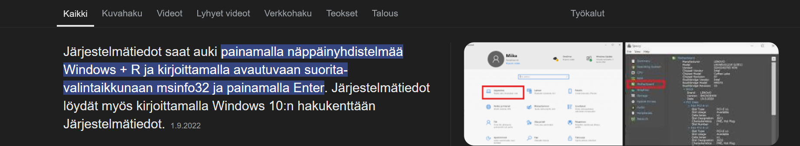

# h1 Oma Linux

Tehtävänanto: x) Lue ja tiivistä (Muutama ranskalainen viiva kustakin artikkelista riittää. Tässä alakohdassa ei tarvitse tehdä testejä tietokoneella)

a) Asenna Linux virtuaalikoneeseen. (Tee raporttia varten uusi virtuaalikone, vaikka olisit asentanut sen aiemmin)

k) Vapaaehtoinen bonus: suosikkiohjelmani Linuxilla. Tee ja raportoi jokin yksinkertainen toimenpide haluamallasi Linux-ohjelmalla

*Raportin kirjoittaminen*: https://terokarvinen.com/2006/raportin-kirjoittaminen-4/ 

## a) Oman Linxuin- ja oman Verkkokoneen asentaminen
### Tietokoneen tiedot
Suoritin: AMD Ryzen 3 3250U with Radeon Graphics, 2600 Mhz. 2 ydin(tä). 4 loogista suoritinta.
Järjestelmän malli: HP Laptop  14-dk1xxx
Järjestelmän tyyppi: x64-based PC
Windowsin version: Microsoft Windows 11 Home

### Asennukset

Aloitan tehtävien tekemisen kirjautumalla koneeseen ja Moodleen sunnuntaina aamuna noin kello 03:?? aikaan. Moodlen kautta linkkaan itseni kurssille, ja sieltä: https://terokarvinen.com/linux-palvelimet/
Luin ohjeita läpi ja tutustuin tehtävänantoon sekä tutustun tarkemmin Teron- sivuihin.
Aloitan Verkkokoneen asentamisen noin klo neljän aikaan (19.1.2025). 
Seuraan ohjeita: https://terokarvinen.com/2021/install-debian-on-virtualbox/#download-debian-iso-image
Samalla, kun ohjelmat latasivat taustalla, tutustuin GitHubin Markdowniin: https://github.com/akx/markdown-cheatsheet-fi/blob/master/Markdown-Ohje.md
Asensin kirjasivuksi, jotta voisin oppia näistä lisää kurssin edetessä. 
Latasin Debian Live -levykuvan (debian-live-12.6.0-amd64-xfce.iso) tietokoneelle

